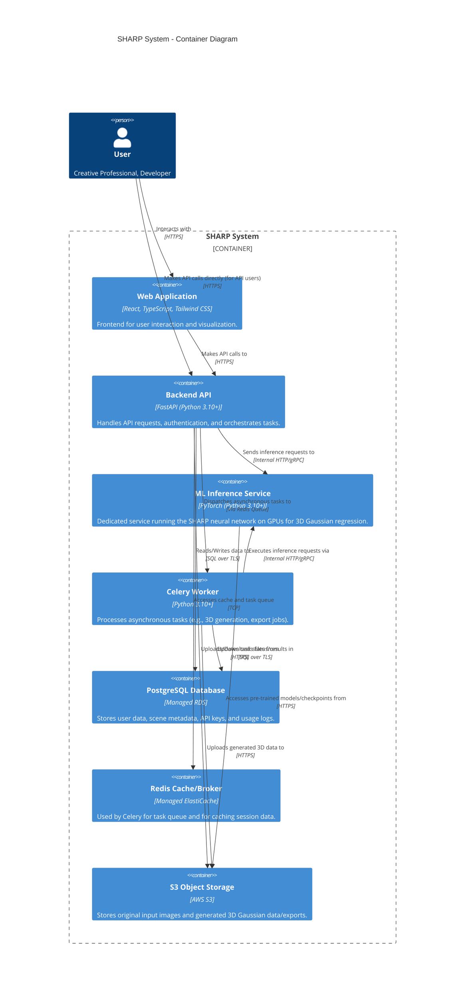
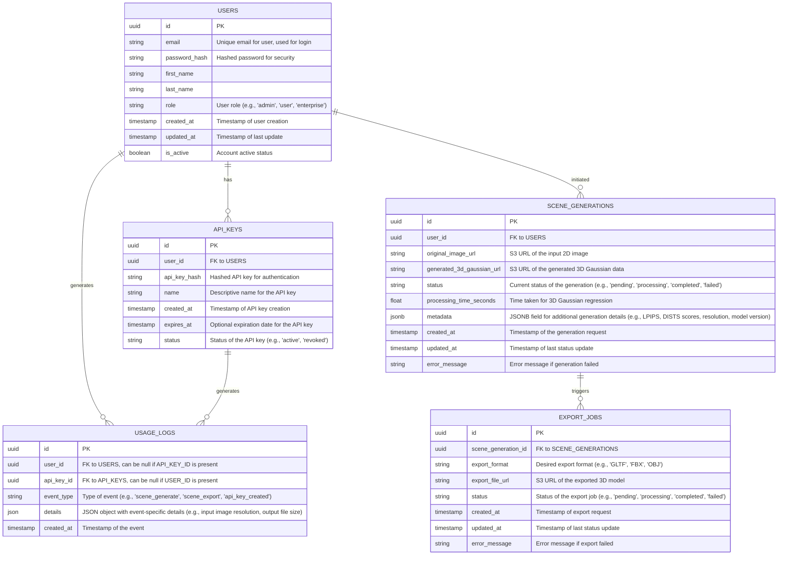

This Technical Design Document (TDD) outlines the architectural design for SHARP, a groundbreaking system for instant, photorealistic 3D view synthesis from a single 2D image. Leveraging the provided PRD and technology stack, this document details the system's structure, data models, API, component design, and operational considerations to ensure a scalable, secure, and high-performance solution.

---

## Technical Design Document: SHARP System

### 1. System Overview

The SHARP system is designed to transform a single 2D input image into a photorealistic, metric 3D Gaussian representation in sub-second timeframes. This core capability is exposed via a robust API and a user-friendly web interface, catering to professional users in gaming, e-commerce, and architectural visualization. The architecture emphasizes high performance for the neural network inference, scalability for API requests, and secure data handling.

At its core, the system comprises a FastAPI backend for API orchestration and business logic, a dedicated PyTorch inference service for the SHARP model, a React-based frontend for user interaction, and a PostgreSQL database for persistent data storage. Asynchronous task processing is handled by Celery with Redis as the message broker. All components are containerized using Docker and deployed on AWS, supporting a scalable, cloud-native infrastructure. The system is engineered to meet the stringent performance and accuracy requirements outlined in the PRD, enabling a new paradigm in 3D content creation.

### 2. System Architecture Diagram

### 3. Data Models & Database Schema

The core entities for the SHARP system include Users, API Keys, Scene Generations, and Usage Logs. These models are designed to support user management, track 3D generation requests, manage API access for developers, and monitor system usage.

**Explanation of Data Types and Constraints:**
*   **`uuid`**: Standard for primary and foreign keys for distributed systems and to avoid sequential IDs.
*   **`string`**: For text fields, including URLs, hashes, names, and statuses. `email` will have a unique constraint. `password_hash` will store securely hashed passwords.
*   **`timestamp`**: For creation and update times, always stored in UTC.
*   **`boolean`**: For flags like `is_active`.
*   **`float`**: For numerical values like `processing_time_seconds`.
*   **`jsonb`**: For `SCENE_GENERATIONS.metadata` and `USAGE_LOGS.details`. `jsonb` (PostgreSQL's binary JSON) is chosen over `json` for better indexing and querying capabilities, enabling flexible storage of varying metadata structures associated with each generation. While Mermaid ERD uses `json`, in actual PostgreSQL schema, this would be `jsonb`.
*   **Indexes**: Unique indexes on `USERS.email` and `API_KEYS.api_key_hash`. B-tree indexes on `created_at`, `updated_at`, and foreign keys (`user_id`, `scene_generation_id`, `api_key_id`) for performance.
*   **Foreign Keys**: Enforced with `ON DELETE RESTRICT` or `ON DELETE CASCADE` as appropriate (e.g., CASCADE for API_KEYS on User deletion, RESTRICT for SCENE_GENERATIONS on User deletion to preserve history).

### 4. API Specifications

The SHARP API will be built using FastAPI, providing clear, auto-documented endpoints.

**Base URL:** `/api/v1`

**Authentication:** JWT-based for user accounts, API key-based for programmatic access.

**Key Endpoints:**

**1. User Management**
*   **`POST /users/register`**
    *   **Description:** Register a new user account.
    *   **Request Body:** `{"email": "string", "password": "string", "first_name": "string", "last_name": "string"}`
    *   **Response Body (201 Created):** `{"id": "uuid", "email": "string", "first_name": "string"}`
*   **`POST /users/login`**
    *   **Description:** Authenticate user and receive JWT token.
    *   **Request Body:** `{"email": "string", "password": "string"}`
    *   **Response Body (200 OK):** `{"access_token": "string", "token_type": "bearer"}`
*   **`GET /users/me`** (Requires JWT)
    *   **Description:** Retrieve current user's profile.
    *   **Response Body (200 OK):** `{"id": "uuid", "email": "string", "first_name": "string", "last_name": "string", "role": "string"}`

**2. API Key Management** (Requires JWT)
*   **`POST /api-keys`**
    *   **Description:** Generate a new API key for the authenticated user.
    *   **Request Body:** `{"name": "string", "expires_at": "timestamp | null"}`
    *   **Response Body (201 Created):** `{"id": "uuid", "key": "string"}` (The actual key is returned only once)
*   **`GET /api-keys`**
    *   **Description:** List all API keys for the authenticated user.
    *   **Response Body (200 OK):** `[{"id": "uuid", "name": "string", "status": "string", "created_at": "timestamp", "expires_at": "timestamp | null"}]`
*   **`DELETE /api-keys/{key_id}`**
    *   **Description:** Revoke an API key.

**3. Scene Generation** (Requires JWT or API Key)
*   **`POST /scenes/generate`**
    *   **Description:** Submit a single 2D image for 3D Gaussian synthesis.
    *   **Request Body:** `{"image": "File (multipart/form-data)", "metadata": "json | null"}`
    *   **Response Body (202 Accepted):** `{"generation_id": "uuid", "status": "string", "message": "Generation initiated"}`
*   **`GET /scenes/{generation_id}`**
    *   **Description:** Retrieve the status and results of a 3D generation.
    *   **Response Body (200 OK):** `{"id": "uuid", "status": "string", "original_image_url": "string", "generated_3d_gaussian_url": "string", "processing_time_seconds": "float", "metadata": "json", "created_at": "timestamp", "updated_at": "timestamp"}` (URLs will be presigned S3 URLs).

**4. Export Functionality** (Requires JWT or API Key)
*   **`POST /scenes/{generation_id}/export`**
    *   **Description:** Initiate an export of a generated 3D Gaussian to a standard format.
    *   **Request Body:** `{"format": "string (e.g., 'GLTF', 'FBX', 'OBJ')"}`
    *   **Response Body (202 Accepted):** `{"export_id": "uuid", "status": "string", "message": "Export initiated"}`
*   **`GET /exports/{export_id}`**
    *   **Description:** Retrieve the status and URL of an export job.
    *   **Response Body (200 OK):** `{"id": "uuid", "scene_generation_id": "uuid", "export_format": "string", "export_file_url": "string", "status": "string", "created_at": "timestamp", "updated_at": "timestamp"}`

### 5. Component Design

**A. Backend (FastAPI, PyTorch, Celery)**

*   **FastAPI Application:**
    *   **Auth Module:** Handles user registration, login (JWT generation/validation), and API key validation. Uses `bcrypt` for password hashing.
    *   **Request Validation:** Pydantic models for all incoming request bodies.
    *   **Service Layer:** Contains business logic for interacting with the database, S3, and dispatching tasks to Celery.
    *   **Controllers/Routers:** Defines API endpoints and maps them to service layer functions.
    *   **Database Integration:** SQLAlchemy ORM with Asyncpg driver for asynchronous PostgreSQL interactions.
    *   **S3 Integration:** `boto3` library for interacting with AWS S3 for image and 3D data storage.
    *   **Celery Integration:** Configures Celery client to enqueue tasks to Redis broker.
*   **ML Inference Service:**
    *   **Dedicated Microservice:** A separate FastAPI application (or similar lightweight server like TorchServe/TensorFlow Serving if suitable) focused solely on running the SHARP PyTorch model. This allows for independent scaling on GPU-enabled instances.
    *   **Model Loading:** Loads the pre-trained SHARP PyTorch model into GPU memory upon startup.
    *   **Inference Endpoint:** Exposes an internal HTTP (or gRPC for performance) endpoint that accepts image data (or S3 pointers) and returns 3D Gaussian parameters.
    *   **GPU Management:** Manages GPU resources, ensuring efficient utilization (e.g., batching, dynamic batch sizing).
    *   **Error Handling:** Catches model inference errors and returns informative messages.
*   **Celery Worker:**
    *   **Asynchronous Task Processing:** Runs as background workers, consuming tasks from the Redis queue.
    *   **Task Definition:** Defines specific tasks for 3D generation, 3D format export, and potentially post-processing.
    *   **3D Generation Task:**
        1.  Downloads input image from S3.
        2.  Calls the ML Inference Service with the image data.
        3.  Receives 3D Gaussian parameters.
        4.  Uploads generated 3D Gaussian data to S3.
        5.  Updates `SCENE_GENERATIONS` table with status, URLs, and metadata.
    *   **Export Task:**
        1.  Downloads 3D Gaussian data from S3.
        2.  Performs conversion to target format (GLTF, FBX, OBJ) using specialized libraries (e.g., Open3D, PyVista, or custom code).
        3.  Uploads exported 3D model to S3.
        4.  Updates `EXPORT_JOBS` table.
    *   **Error Handling & Retries:** Implements robust error handling with exponential backoff for retries.

**B. Frontend (React, TypeScript, Tailwind CSS)**

*   **Component-Based UI:** React components for a modular and reusable interface.
*   **State Management:** React Context API or Redux/Zustand for managing global application state (e.g., user authentication, current generation status).
*   **API Client:** Uses `axios` or `fetch` for interacting with the FastAPI backend.
*   **Image Upload:** Component for users to select and upload 2D images, handling progress indication.
*   **3D Viewer:** Integrates a WebGL-based 3D viewer (e.g., Three.js, Babylon.js) to render and interact with the generated 3D Gaussian representation (and potentially converted meshes). This component will handle real-time rendering as per PRD.
*   **Dashboard:** Displays user's generated scenes, export jobs, and API key management.
*   **Styling:** Tailwind CSS for a utility-first CSS framework, ensuring a consistent and responsive design.
*   **TypeScript:** Provides strong typing for improved code quality, maintainability, and reduced bugs.

### 6. Security & Privacy

*   **Authentication (AuthN):**
    *   **User Accounts:** JWT (JSON Web Tokens) for authenticating users. Tokens are short-lived and refreshed.
    *   **API Keys:** Unique, securely generated API keys for programmatic access. Keys are hashed and stored in the database (`API_KEYS.api_key_hash`), never stored in plaintext. Keys are passed via `X-API-Key` header.
*   **Authorization (AuthZ):**
    *   **Role-Based Access Control (RBAC):** Users are assigned roles (e.g., `user`, `enterprise`, `admin`). Access to specific endpoints and resources is governed by these roles. Policies define which roles can perform which actions.
    *   **Resource-Level Authorization:** Users can only access/manage their own `SCENE_GENERATIONS`, `API_KEYS`, and `EXPORT_JOBS`.
*   **Data Encryption:**
    *   **In Transit:** All communication (frontend to backend, API to backend, internal services) uses TLS 1.2 or higher. AWS Load Balancers enforce this.
    *   **At Rest:**
        *   PostgreSQL database: Encrypted using AWS RDS encryption (KMS).
        *   S3 Buckets: Server-side encryption (SSE-S3 or SSE-KMS) for original images and generated 3D data.
        *   Redis: Encryption in transit and at rest for ElastiCache.
*   **PII Handling:**
    *   **Minimal Data Collection:** Only essential PII (email, first/last name) is collected for user accounts.
    *   **Anonymization:** Usage logs will be designed to avoid direct PII where possible or anonymize/pseudonymize sensitive details.
    *   **Data Retention:** Policies will be established for data retention, especially for original input images and generated data, aligning with user preferences and compliance needs (e.g., GDPR, CCPA).
*   **Input/Output Validation:**
    *   Strict validation of all API inputs (image types, file sizes, JSON schemas) to prevent injection attacks and ensure data integrity.
    *   Output data is sanitized before being returned to users.
*   **Secure Coding Practices:** Adherence to OWASP Top 10 guidelines. Regular security audits and vulnerability scanning.
*   **Infrastructure Security:** VPCs, security groups, network ACLs, IAM roles with least privilege for all AWS resources.

### 7. Error Handling & Logging

*   **Standardized Error Responses:**
    *   API will return consistent JSON error objects for all failures.
    *   Errors will include `code` (internal identifier), `message` (human-readable), and `details` (optional, for validation errors).
    *   Appropriate HTTP status codes will be used (e.g., 400 Bad Request, 401 Unauthorized, 403 Forbidden, 404 Not Found, 500 Internal Server Error, 503 Service Unavailable).
*   **Centralized Logging:**
    *   All services (FastAPI, ML Inference, Celery Workers) will log to standard output (stdout/stderr).
    *   These logs will be captured by AWS CloudWatch Logs (or a dedicated ELK stack if scaled further).
    *   Logs will be structured (JSON format) and include correlation IDs for tracing requests across services.
    *   Logging levels: DEBUG, INFO, WARNING, ERROR, CRITICAL.
*   **Tracing:**
    *   Implement OpenTelemetry for distributed tracing to monitor request flow across microservices (FastAPI, ML Inference, Celery). This helps in debugging complex issues and performance bottlenecks.
*   **Monitoring & Alerting:**
    *   CloudWatch Metrics for CPU, memory, network, and application-specific metrics (e.g., number of successful generations, average inference time).
    *   Alerts configured on critical metrics (e.g., error rates, high latency, resource utilization) to notify on-call engineers.
*   **Idempotency:** Design asynchronous tasks to be idempotent where possible, allowing safe retries without unintended side effects.

### 8. Deployment & Infrastructure

*   **CI/CD Pipeline:**
    *   **Version Control:** GitHub for source code management.
    *   **Build Automation:** GitHub Actions (or AWS CodePipeline/CodeBuild) will automate:
        1.  Linting and static analysis (e.g., Black, Flake8, ESLint, Prettier).
        2.  Unit and integration testing.
        3.  Docker image building for each service.
        4.  Pushing Docker images to Amazon ECR (Elastic Container Registry).
        5.  Deployment to various environments (dev, staging, production).
*   **Containerization (Docker):**
    *   Each service (FastAPI API, ML Inference, Celery Worker, Frontend Nginx) will be containerized using Docker.
    *   Dockerfiles will be optimized for small image sizes and efficient caching.
*   **Orchestration (AWS ECS/Fargate):**
    *   **Core Services (FastAPI API, Celery Workers):** Deployed on AWS ECS (Elastic Container Service) with Fargate launch type for serverless container management, abstracting away EC2 instance management.
    *   **ML Inference Service:** Deployed on AWS ECS using EC2 launch type with GPU-enabled instances (e.g., p3.2xlarge, g4dn.xlarge) due to the demanding nature of PyTorch inference. Auto-scaling groups will be configured based on GPU utilization and request queue length.
    *   **Load Balancing:** AWS Application Load Balancers (ALB) will distribute traffic to the API and Frontend services, handling TLS termination.
    *   **Database:** AWS RDS for PostgreSQL (multi-AZ for high availability).
    *   **Cache/Broker:** AWS ElastiCache for Redis (multi-AZ for high availability).
    *   **Object Storage:** AWS S3 for all static assets and generated 3D data.
    *   **Networking:** All resources will reside in a Virtual Private Cloud (VPC) with appropriate subnets, security groups, and network ACLs for isolation and controlled access.
*   **Scalability:**
    *   **Horizontal Scaling:** ECS services configured with auto-scaling policies based on CPU utilization, request count per target, and potentially custom metrics (e.g., Celery queue depth for workers, GPU utilization for ML inference).
    *   **Database Scaling:** RDS Read Replicas for read-heavy workloads.
    *   **CDN:** AWS CloudFront will be used to cache frontend assets and optimize delivery to global users.
*   **Observability:** Integrated with AWS CloudWatch for logs, metrics, and alarms. Dashboards will provide real-time insights into system health and performance.
